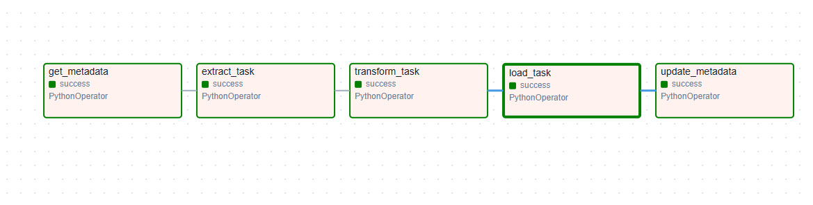
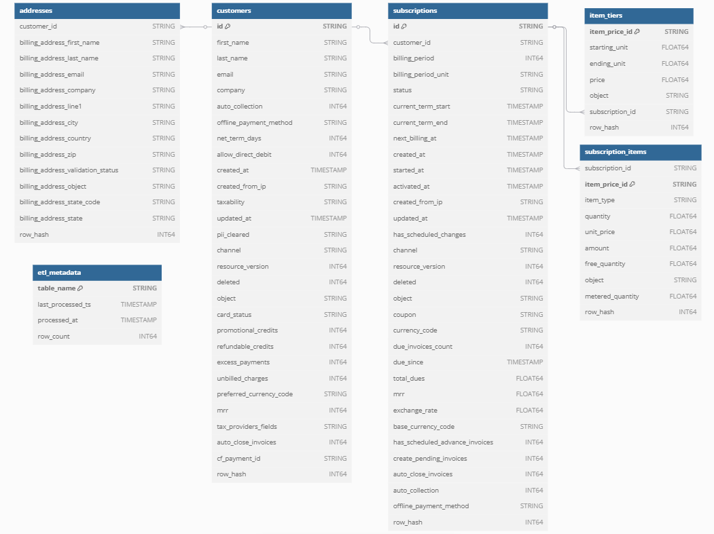

# Airflow BigQuery ETL Pipeline

ETL pipeline for processing JSON data into Google BigQuery using Apache Airflow.

## Main Features
- Docker-based Airflow 2.10.5
- Modular ETL components
- BigQuery integration
- Data validation & sanitization

# ETL Pipeline Documentation

## **1. Overview**
This document outlines the architecture and implementation details of an ETL pipeline designed to process subscription data from JSON files into normalized BigQuery tables. The ETL data pipeline focuses on **incremental loading**, **data quality**, and **maintainability**.

---

## **2. Architecture**

### **2.1 Components**
- **Source**: JSON file containing nested data
- **Orchestrator**: Apache Airflow (DAG-driven workflow)
- **Processing**: Python (pandas, BigQuery client)
- **Destination**: Google BigQuery (Normalized tables)

---

## **3. Pipeline Stages**
  

### **3.1 Extraction**
- **Input**: `etl.json` files
- **Key Features**:
  - Incremental loading using timestamp tracking
  - Cross-table change detection (support added for subscriptions + customers)
  - Logging of filtered records

### **3.2 Transformation**
- **Core Operations**:
  - JSON flattening with hierarchy preservation
  - Data type conversion (Unix timestamps → BigQuery types)
  - Hash generation for change detection (`row_hash`)
  - Schema enforcement and column sanitization

- **Normalization**:
  - Split into 5 tables:  
    `subscriptions`, `customers`, `addresses`, `subscription_items`, `item_tiers`

### **3.3 Loading**
- **Strategy**:
  - Staging tables for atomic operations
  - MERGE statements for idempotent updates
  - Schema validation pre-load
  - Row-level change tracking via hashes

---

## **4. Data Model**

---

## **5. Key Features**

### **5.1 Incremental Processing**
- Metadata tracking in `etl_metadata` table
- Minimum timestamp cutoff across tables
- Hash-based change detection

### **5.2 Data Quality**
- Schema validation rules
- Null handling for missing columns
- Type conversion safeguards

### **5.3 Operational Reliability**
- Airflow task retries
- Staging table isolation
- Detailed logging (row counts, merge results)

---

## **6. Technical Specifications**

### **6.1 Tools & Libraries**
- **Core**: Python 3.8+
- **Data Processing**: pandas, flatten-json
- **BigQuery**: google-cloud-bigquery v3.0+
- **Orchestration**: Apache Airflow 2.0+

### **6.2 Docker Container**
The project is containerized using Docker for easy setup and deployment. The Docker setup includes:

- **Base Image**: `apache/airflow:2.10.5-python3.8`
- **Dependencies**:
  - Installed via `requirements.txt`:
  - Airflow plugins and connections configured in `docker-compose.yaml`

### **6.3 Configuration**
- **`etl_config.py`**: Schemas, table metadata
- **`METADATA_CONFIG`**: Dataset/table mappings
- **Environment Variables**: GCP credentials, Airflow settings

---

## **7. Implementation Highlights**

### **7.1 Optimizations**
- **Memory Efficiency**: Chunk-based JSON processing
- **Performance**: Parallel table loading (LOAD_ORDER)

### **7.2 Challenges Solved**
- Nested JSON → Relational model conversion
- Cross-table incremental sync
- Schema evolution handling

---